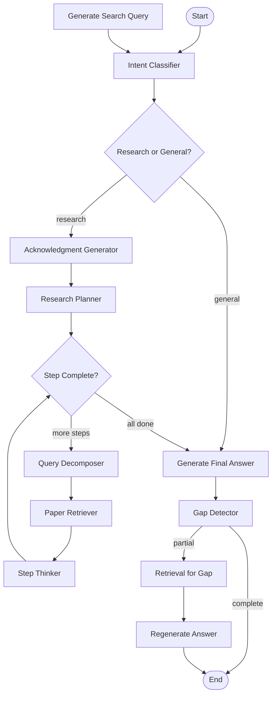

# Migration Strategy: DSPy → LangChain/LangGraph

## Executive Summary

**Goal**: Migrate current DSPy-based custom agent orchestration to LangChain ecosystem while preserving DSPy's prompt optimization capabilities.

**Key Decision**: Use **LangGraph** for orchestration (not Deep Agents) with **DSPy integration** for prompt optimization.

**Rationale**:
- LangGraph provides superior state management and workflow control
- Current system has complex multi-step flows that map well to LangGraph's StateGraph
- Deep Agents is too opinionated for our custom research workflow
- DSPy prompt optimization provides unique value we want to keep

---

## Current Architecture Analysis

### Current Components

| Component | Type | Purpose |
|-----------|------|---------|
| `IntentClassifier` | DSPy Module | Route research vs general queries |
| `QueryGenerator` | DSPy Module | Optimize natural language → search keywords |
| `QueryReformulator` | DSPy Module | Broaden failed queries |
| `QueryDecomposer` | DSPy Module | Split complex queries into 2-4 sub-queries |
| `AcknowledgmentGenerator` | DSPy Module | Generate brief pre-research acknowledgment |
| `ResearchPlanner` | DSPy Module | Create 2-3 step research plan |
| `PaperRAG` | DSPy Module (ChainOfThought) | Generate cited answer with history |
| `GapDetector` | DSPy Module | Detect incomplete answers |
| `PaperRetriever` | Custom | Voyage AI + PGVector search |
| `stream_dspy_response()` | Custom | SSE streaming orchestration |
| `SessionManager` | Custom | Redis + DB session persistence |

### Current Flow (Streaming Mode)

```
User Query
  ↓
[PARALLEL] Intent Classifier + Query Generator
  ↓
Research Question?
  ├─ No → Direct RAG response (general)
  └─ Yes → Acknowledgment → Research Planner
           ↓
         [FOR EACH PLAN STEP]
           ├─ Query Decomposer (if multi_query)
           ├─ Paper Retriever (parallel sub-queries)
           ├─ Step Thinker (stream thinking tokens)
           └─ Step Done
         [END LOOP]
           ↓
         Final Answer (CoT + Answer streaming)
           ↓
         Gap Detector
           ├─ Complete → Return response
           └─ Partial → Re-retrieve → Re-generate → Return
```

**Key Characteristics**:
- Up to 9+ LLM calls per user message (worst case)
- Complex streaming with 10+ SSE event types
- Hybrid: cheap LM for routing, main LM for generation
- Multi-step planning with dynamic query strategies
- Adaptive re-retrieval (gap detection)

---

## Proposed LangGraph Architecture

### State Schema Design

```python
from typing import Annotated, TypedDict
from langgraph.graph.message import add_messages
import operator

class ResearchState(TypedDict):
    """Shared state across all nodes"""

    # Core communication
    messages: Annotated[list, add_messages]  # Conversation history

    # Input
    query: str
    conversation_id: str | None

    # Intent & Planning
    intent_category: str  # "research" | "general"
    search_query: str
    plan_steps: list[dict]  # SmartPlanStep objects

    # Retrieval
    retrieved_papers: list  # PaperResult objects
    context: str

    # Generation
    answer: str
    cited_papers: list
    reasoning: str

    # Gap Detection
    gap_detected: bool
    gap_query: str

    # Workflow control
    current_step_index: int
    step_thinking: dict[int, str]  # step_id → thinking content
    iteration: int
```

### Graph Structure



### Node Implementations

#### 1. Intent Classifier Node
```python
def intent_classifier_node(state: ResearchState) -> dict:
    """Classify query as research or general."""
    # Use DSPy IntentClassifier
    result = intent_classifier(question=state["query"])
    return {"intent_category": result.category}
```

#### 2. Query Generator Node
```python
def query_generator_node(state: ResearchState) -> dict:
    """Generate optimized search query."""
    # Use DSPy QueryGenerator
    result = query_generator(user_question=state["query"])
    return {"search_query": result.search_query}
```

#### 3. Research Planner Node
```python
def research_planner_node(state: ResearchState) -> dict:
    """Create research plan."""
    # Use DSPy ResearchPlanner
    is_research = state["intent_category"] == "research"
    steps = research_planner.create_plan(
        question=state["query"],
        is_research=is_research
    )
    return {"plan_steps": [s.dict() for s in steps], "current_step_index": 0}
```

#### 4. Parallel Retrieval with Send API
```python
from langgraph.types import Send

def fan_out_retrieval(state: ResearchState) -> list[Send]:
    """Create parallel retrieval tasks for multi-query strategy."""
    current_step = state["plan_steps"][state["current_step_index"]]

    if current_step["query_strategy"] == "multi_query":
        # Decompose query
        sub_queries = query_decomposer.decompose(
            question=state["query"],
            hint=current_step.get("decomposition_hint")
        )

        # Create parallel tasks
        return [
            Send("retrieve_node", {"sub_query": q, "step_id": current_step["id"]})
            for q in sub_queries
        ]
    else:
        # Single query
        return [
            Send("retrieve_node", {
                "sub_query": state["search_query"],
                "step_id": current_step["id"]
            })
        ]

def retrieve_node(state: dict) -> dict:
    """Execute paper retrieval for one query."""
    papers = retriever.get_papers_with_context(state["sub_query"])
    return {"retrieved_papers": papers}
```

#### 5. Gap Detection Conditional Edge
```python
def gap_check_router(state: ResearchState) -> str:
    """Route based on gap detection."""
    if state.get("gap_detected"):
        return "retrieve_gap"
    return END
```

### DSPy Integration Pattern

**Key Insight**: Wrap DSPy modules as LangGraph nodes, use DSPy for prompt optimization only.

```python
# DSPy modules stay in services/rag.py
# LangGraph uses them as node functions

class GraphAgentService:
    """LangGraph-orchestrated agent service."""

    def __init__(self):
        # DSPy modules (unchanged)
        self.intent_classifier = IntentClassifier()
        self.query_generator = QueryGenerator()
        self.research_planner = ResearchPlanner()
        self.paper_rag = PaperRAG(retriever)
        self.gap_detector = GapDetector()

        # LangGraph
        self.graph = self._build_graph()

    def _build_graph(self) -> CompiledStateGraph:
        """Build the LangGraph state machine."""
        builder = StateGraph(ResearchState)

        # Add nodes
        builder.add_node("classify_intent", self._classify_node)
        builder.add_node("generate_query", self._query_node)
        builder.add_node("plan_research", self._plan_node)
        builder.add_node("retrieve_papers", self._retrieve_node)
        builder.add_node("generate_answer", self._answer_node)
        builder.add_node("check_gap", self._gap_node)

        # Add edges
        builder.add_edge(START, "classify_intent")
        builder.add_conditional_edges(
            "classify_intent",
            self._route_on_intent,
            {"general": "generate_answer", "research": "plan_research"}
        )
        # ... more edges

        return builder.compile(checkpointer=MemorySaver())

    def _classify_node(self, state: ResearchState) -> dict:
        """Node: Classify intent using DSPy."""
        result = self.intent_classifier(question=state["query"])
        return {"intent_category": result.category}

    # ... other node methods
```

---

## Migration Roadmap

### Phase 1: Foundation (Week 1-2)

**Goal**: Set up LangGraph infrastructure without breaking existing system.

1. **Install Dependencies**
   - `langgraph`, `langchain-core`, `langchain-openai`
   - Keep `dspy` (NOT removing it)

2. **Create New Service Layer**
   - `backend/app/services/graph_agent.py` - New LangGraph service
   - Keep `rag.py` unchanged for now

3. **Basic State Graph**
   - Define `ResearchState` schema
   - Create 2-node graph: classify → generate_answer
   - Test with general questions only

4. **Dual Endpoint Strategy**
   - `/chat/basic` → uses existing `rag_service`
   - `/chat/graph` → new `graph_agent_service`
   - A/B testing possible

**Deliverables**:
- Working LangGraph service (basic)
- New endpoint `/chat/graph`
- Unit tests for state management

---

### Phase 2: Core Migration (Week 3-4)

**Goal**: Migrate all DSPy modules to LangGraph nodes.

1. **Node Migration**
   - Create LangGraph nodes for each DSPy module:
     - `intent_classifier_node()`
     - `query_generator_node()`
     - `research_planner_node()`
     - `paper_rag_node()`
     - `gap_detector_node()`

2. **Streaming Integration**
   - Implement custom streaming callback for LangGraph
   - Emit same SSE events as current system
   - Ensure backward compatibility

3. **Multi-Step Planning**
   - Implement plan execution loop
   - Add step thinking streaming
   - Support both single/multi-query strategies

**Deliverables**:
- All nodes implemented
- Streaming parity with `/chat/basic`
- Multi-step research working

---

### Phase 3: Advanced Features (Week 5-6)

**Goal**: Add LangGraph-specific improvements.

1. **Checkpointing**
   - Add `MemorySaver` or Postgres checkpointer
   - Enable pause/resume on long-running queries
   - Persist state to Redis

2. **Human-in-the-Loop**
   - Add `interrupt()` for manual approval
   - Allow query plan editing before execution
   - Enable interactive refinement

3. **Parallel Execution**
   - Implement `Send` API for parallel retrieval
   - Optimize multi-query performance
   - Benchmark against sequential

4. **Error Handling**
   - Add `RetryPolicy` on retriever nodes
   - Graceful fallback on DSPy failures
   - Circuit breaker for external APIs

**Deliverables**:
- Production-ready checkpointing
- Optional human-in-the-loop mode
- Performance benchmarks

---

### Phase 4: DSPy Optimization Integration (Week 7-8)

**Goal**: Leverage DSPy's prompt optimization within LangGraph.

1. **DSPy Teleprompter Integration**
   - Compile DSPy modules with few-shot examples
   - Use DSPy optimizer for node prompts
   - Track prompt versions with MLflow

2. **Hybrid Approach**
   - Critical nodes use optimized DSPy prompts
   - Simple nodes use raw LangChain
   - Fallback chain on DSPy failures

3. **Evaluation Loop**
   - Log node performance metrics
   - Auto-optimize prompts weekly
   - A/B test optimized vs baseline

**Deliverables**:
- DSPy-optimized prompts in production
- Automated prompt optimization pipeline
- Performance improvement metrics

---

### Phase 5: Cutover & Cleanup (Week 9-10)

**Goal**: Full migration to LangGraph, deprecate old system.

1. **Feature Parity Validation**
   - Test all existing features work identically
   - Compare response quality (BLEU, citations)
   - Load test with production traffic

2. **Cutover Strategy**
   - Option A: Big bang (switch DNS)
   - Option B: Gradual (10% → 50% → 100% traffic)
   - Run both systems in parallel during transition

3. **Deprecation**
   - Mark `/chat/basic` as deprecated
   - Add migration notice in API docs
   - Remove old code after 30 days

**Deliverables**:
- Full production cutover
- Decommissioned old code
- Updated documentation

---

## DSPy + LangChain Integration Strategy

### Option 1: Official Integration (Recommended if it works)

```python
from langchain_community.adapters.dspy import DSPy

# Wrap DSPy module as LangChain tool
dspy_module = IntentClassifier()
langchain_tool = DSPy(module=dspy_module)

# Use in LangGraph node
def classify_node(state: ResearchState) -> dict:
    result = langchain_tool.invoke(state["query"])
    return {"intent_category": result.category}
```

### Option 2: Manual Wrapper (Fallback)

```python
def wrap_dspy_as_node(dspy_module: dspy.Module):
    """Wrap any DSPy module as LangGraph node."""
    def node_func(state: ResearchState) -> dict:
        # Call DSPy module
        result = dspy_module(**state)

        # Convert DSPy Prediction to dict
        return result.__dict__
    return node_func

# Usage
builder.add_node(
    "classify",
    wrap_dspy_as_node(intent_classifier)
)
```

### Option 3: Hybrid (Best of Both)

```python
class HybridAgent:
    """Use DSPy for prompts, LangGraph for orchestration."""

    def __init__(self):
        # DSPy modules (unchanged)
        self.dspy_modules = {
            "intent": IntentClassifier(),
            "query": QueryGenerator(),
            "rag": PaperRAG(retriever),
        }

        # Compile with DSPy optimizer (optional)
        self._optimize_prompts()

        # LangGraph for orchestration
        self.graph = self._build_graph()

    def _optimize_prompts(self):
        """Run DSPy teleprompter to optimize prompts."""
        from dspy.teleprompt import BootstrapFewShot

        optimizer = BootstrapFewShot(
            metric=self._eval_metric,
            max_bootstrapped_demos=3
        )

        self.dspy_modules["rag"] = optimizer.compile(
            self.dspy_modules["rag"],
            trainset=self._get_training_data()
        )
```

---

## Benefits of Migration

| Aspect | Current (DSPy) | After (LangGraph) |
|--------|---------------|-------------------|
| **Orchestration** | Custom Python code | Declarative StateGraph |
| **State Management** | Manual dict passing | Typed reducers + checkpointing |
| **Observability** | Custom logging + MLflow | LangSmith + built-in tracing |
| **Error Handling** | Try/catch blocks | RetryPolicy + declarative edges |
| **Parallelism** | Manual asyncio | Send API (automatic) |
| **Testing** | Mock everything | State graph inspection |
| **Human-in-the-Loop** | Not possible | Built-in `interrupt()` |
| **Deployment** | Monolithic | Subgraph composable |

---

## Risks & Mitigations

| Risk | Impact | Mitigation |
|------|--------|------------|
| **Streaming complexity** | High - SSE events are custom | Reuse existing streaming utils, emit same event types |
| **DSPy integration** | Medium - official support limited | Build manual wrappers, keep DSPy for prompts only |
| **Performance regression** | Medium - abstraction overhead | Benchmark Phase 4, optimize hot paths |
| **Feature gaps** | Low - LangGraph is mature | Document workarounds, contribute back if needed |
| **Team learning curve** | Medium - new paradigm | Pair programming, internal training |

---

## Success Criteria

### Technical Metrics
- [ ] All existing `/chat/basic` features work in `/chat/graph`
- [ ] Response time within 10% of baseline
- [ ] Streaming latency within 5% of baseline
- [ ] 99.5% uptime during cutover

### Quality Metrics
- [ ] Answer quality (BLEU/Cosine) ≥ baseline
- [ ] Citation accuracy ≥ baseline
- [ ] No regression in gap detection effectiveness

### Operational Metrics
- [ ] Reduced code complexity (measured by cyclomatic complexity)
- [ ] Improved debuggability (time to root cause)
- [ ] Better observability (LangSmith traces vs manual logs)

---

## Open Questions

1. **Checkpointing Backend**: Use in-memory `MemorySaver` or Postgres checkpointer?
   - **Recommendation**: Start with `MemorySaver`, migrate to Postgres in Phase 3

2. **DSPy Optimization Frequency**: How often to re-run teleprompter?
   - **Recommendation**: Weekly automated optimization, manual trigger available

3. **Human-in-the-Loop**: Should this be always-on or opt-in?
   - **Recommendation**: Opt-in via `meta_params.enable_human_review`

4. **Deep Agents**: Should we use it for simple queries?
   - **Recommendation**: No. Build everything in LangGraph for consistency

---

## References

- LangGraph docs: https://langchain-ai.github.io/langgraph/
- DSPy docs: https://dspy.ai
- LangChain-DSPy integration: https://python.langchain.com/docs/integrations/providers/dspy/
- Deep Agents: https://github.com/langchain-ai/deepagents
- Current system analysis: `agent_flow_analysis.md.resolved`
